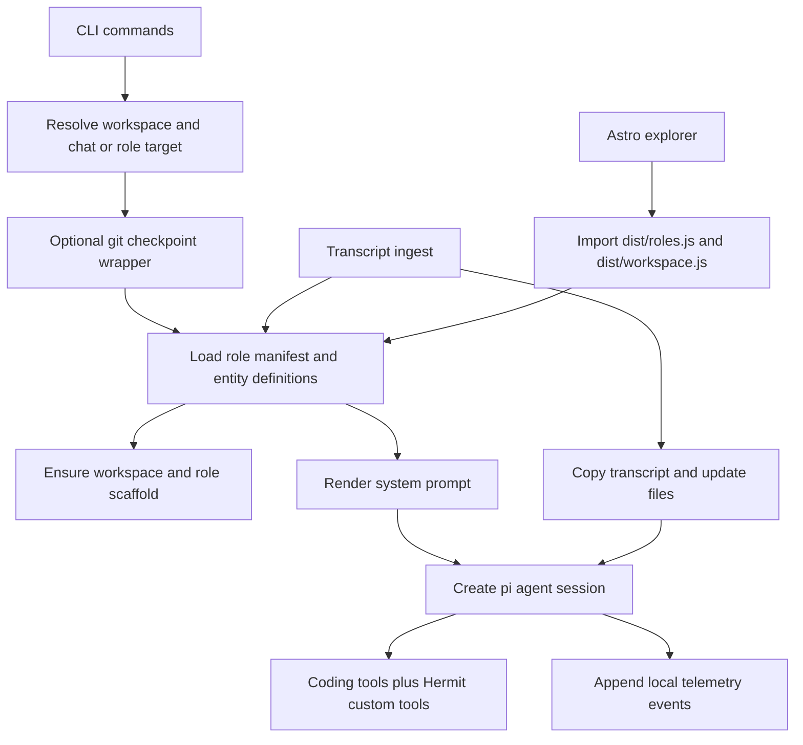

# Architecture

## Purpose

Hermit is a local, file-first runtime where agents are the application. Agents own domain state, make decisions, and evolve the workspace and code. The workspace on disk is canonical — there is no separate database or service layer.

Code handles the deterministic infrastructure that should not depend on model improvisation: command routing, role resolution, session construction, entity scaffolding, transcript placement, validation, git checkpointing, and local telemetry. Everything else — strategy, judgment, record-keeping, entity updates — is agent work driven by prompts and skills.

## Invariants

- Canonical state lives in files. Agents are the writers; code provides structure and plumbing.
- Roles, prompts, skills, templates, and entity definitions are loaded from the workspace at runtime.
- Domain structure stays in markdown and frontmatter; deterministic mechanics stay in code.
- The explorer is intentionally read-only. Agents manage application state; the explorer renders it.
- Telemetry is local and append-only.

## Workspace Model

### Shared root

- `entities/` holds canonical entity records, including role-managed entities.
- `entity-defs/entities.md` defines entity types and optional explorer renderer config.
- `entity-defs/` also holds entity templates and optional renderer modules.
- `skills/` holds shared pi skills.
- `prompts/` holds shared prompt files and shared templates.
- `agents/` holds one directory per role.

### Per role

Each `agents/<role-id>/` directory contains:

- `role.md` for the role manifest
- `AGENTS.md` for the role-level prompt and prompt index
- `agent/record.md` and `agent/inbox.md`
- `prompts/` for role-local prompt files
- `skills/` for role-local skills
- `.role-agent/sessions/` for persisted interactive sessions
- `.role-agent/heartbeat-sessions/` for persisted heartbeat sessions

Role-owned entities live under `entities/`, not under `agents/<role-id>/`. The runtime distinguishes shared versus role-managed entities by the directory roots declared in `entity-defs/entities.md`.

Runtime scaffolding and `doctor` hard-require `entities/`, `agents/`, `entity-defs/`, and `skills/`. Role sessions also require `prompts/`, `AGENTS.md`, shared agent templates, and any prompt or renderer files referenced by the role.

## Runtime Flow

## Command Surface

- `chat` starts an interactive session. Resolution order: `--role`, inferred role from the current directory under `agents/`, last used chat role from `.hermit/state/last-role.txt`, then `Hermit`. The Hermit fallback applies even when roles exist. Bootstrap mode is enabled only when the resolved target is `Hermit` and no roles are configured. Interactive chat supports runtime role switching through the `switch_role` tool.
- `ask` runs a one-shot prompt in a role-backed session. Resolution: `--role`, inferred role from cwd, then single-role auto-selection. No last-role fallback, no Hermit fallback. Errors when no role can be resolved.
- `heartbeat` runs one persisted role-backed upkeep turn. Uses the same resolution as `ask`. Strategic review is selected when `--strategic-review` is passed or when `last_strategic_review` in `agent/record.md` is missing or older than 24 hours. The review behavior itself is prompt-driven; the runtime only selects which prompt to use.
- `heartbeat-daemon` loops over all configured roles on a fixed interval, delegating a normal `heartbeat` run per role.
- `ingest transcript` places a transcript into the matched entity's evidence directory (or the role's unmatched directory), then runs the role's ingest session. When the transcript is stored as unmatched, the ingest session does not run.
- `telemetry report` aggregates local telemetry into Markdown and JSON reports.
- `doctor` validates shared workspace structure plus the selected role contract.

## Prompt Assembly

System prompt construction:

1. Load `prompts/*.md`, sorted by filename. Subdirectories are not loaded recursively.
2. For role-backed sessions, append `agents/<role-id>/AGENTS.md`.
3. Append any explicitly requested role prompt files (e.g. `transcript_ingest.system_prompts`).
4. For Hermit bootstrap chat only, append all `.md` files under `prompts/bootstrap/`.

Role-local prompts are on-demand; they are loaded only when a session explicitly requests them.

### Template placeholders

| Placeholder | Fallback |
|---|---|
| `{{workspaceRoot}}` | — |
| `{{roleId}}` | `Hermit` |
| `{{roleRoot}}` | `.` |
| `{{entityId}}` | `not-selected` |
| `{{entityPath}}` | `not-selected` |
| `{{transcriptPath}}` | `not-selected` |
| `{{currentDateTimeIso}}` | `unknown` |
| `{{currentLocalDateTime}}` | `unknown` |
| `{{currentTimeZone}}` | `unknown` |
| `{{gitBranch}}` | `unknown` |
| `{{gitHeadSha}}` | `unknown` |
| `{{gitHeadShortSha}}` | `unknown` |
| `{{gitHeadSubject}}` | `unknown` |
| `{{gitDirty}}` | `unknown` |
| `{{gitCheckpointBeforeSha}}` | `not-created` |
| `{{gitCheckpointAfterSha}}` | `not-created` |

## Sessions, Skills, and Tools

Session creation lives in `src/session-runtime.ts` and uses `@mariozechner/pi-coding-agent`.

Skills:

- Hermit sessions load from `skills/`.
- Role sessions load from `skills/` and `agents/<role-id>/skills/`.
- Skills stay on-demand through pi skill discovery; they are not concatenated into the system prompt.

Session history:

- Hermit interactive: `.hermit/sessions/hermit`
- Role interactive: `agents/<role-id>/.role-agent/sessions`
- Role heartbeat: `agents/<role-id>/.role-agent/heartbeat-sessions`

Every session gets standard coding tools. Custom tools by session type:

- **Role sessions**: `entity_lookup`, `web_search`, one `create_<entity>_record` per entity definition
- **Role interactive** (with role switching enabled): adds `switch_role`
- **Hermit sessions**: `web_search`, plus `switch_role` when role switching is enabled

Model: `ROLE_AGENT_MODEL` env var, fallback in `src/constants.ts`. Thinking level: `ROLE_AGENT_THINKING_LEVEL` env var, default `medium`.

## Entity and Workspace Mechanics

`entity-defs/entities.md` is the runtime contract for entity structure. Each definition specifies:

- `key`, `label`, `type`
- `create_directory`, optional `scan_directories`, optional `exclude_directory_names`
- `id_strategy`: `prefixed-slug`, `year-sequence-slug`, or `singleton`
- `id_source_fields`, optional `id_prefix`, `name_template`
- `fields` with per-field `key`, `label`, `type` (`string` or `string-array`), `description`, optional `required` and `defaultValue`
- `files` with per-file `path` and `template`
- Optional `status_field`, `owner_field`, `include_in_initialization`, `extra_directories`
- Optional `explorer.renderers` for detail-level and file-level custom rendering

`ensureWorkspaceScaffold()` creates shared root directories and role-local directories. For existing roles, it backfills `agent/record.md` and `agent/inbox.md` from `prompts/templates/agent/*.md` when missing.

`createRoleEntityRecord()` renders declared entity files, computes a deterministic ID, and writes without overwriting unless forced.

Entity scanning is filesystem-based. A directory containing `record.md` is an entity leaf. Shared entity scanning excludes directory roots claimed by role entity definitions. Role entity scanning uses each definition's `scan_directories` or `create_directory`.

### Transcript ingest

Pipeline:

1. Resolve the target role and verify `transcript_ingest` is declared.
2. Match the target entity explicitly or infer from the transcript filename.
3. If ambiguous, prompt the user to choose or store as unmatched.
4. Copy the transcript into the entity evidence directory or the role's unmatched directory.
5. Append a line to the configured activity log.
6. Run a role-backed ingest session using the command prompt and any configured extra system prompts. Skipped when the transcript is stored as unmatched.

## Git Checkpoints

`chat`, `ask`, and `heartbeat` run inside `withGitCheckpoint()`. `heartbeat-daemon` does not checkpoint as one process; each delegated heartbeat has its own checkpoint wrapper.

- Before the command: checkpoint if the repo is dirty.
- After the command: checkpoint if the repo is dirty.
- Dirty detection: `git status --porcelain=v1 --untracked-files=all`.
- Checkpoints stage and commit the full changed file set, including untracked files.
- No path allowlist. No automatic rollback.

## Validation

`doctor` is a structural validator. Checks:

- Required shared root directories (`entities`, `agents`, `entity-defs`, `skills`)
- Role manifest loading and directory identity
- `AGENTS.md` presence and linked markdown files
- Required shared agent templates and transcript ingest prompts
- Explorer renderer modules
- Duplicate entity IDs
- Missing frontmatter fields in entity records
- Unresolved template placeholders and generic placeholder lines
- Missing entity files declared by entity definitions
- `OPENAI_API_KEY` presence (warning, not error)

Exits non-zero only when at least one `error`-level finding exists.

## Explorer

Astro SSR app under `explorer/`. Read-only by design — agents own and mutate workspace state through sessions; the explorer is a viewer, not an editor. It imports `dist/roles.js` and `dist/workspace.js` from the repo root (fails until `npm run build` is run) and uses the same entity definitions and scanning logic as the CLI.

| Route | Content |
|---|---|
| `/` | Home |
| `/architecture` | Architecture |
| `/license` | License |
| `/entities` | Entity type list |
| `/entities/:entityType` | Entity list |
| `/entities/:entityType/:entityId` | Entity detail |
| `/agents` | Agent list |
| `/agents/:roleId` | Agent detail |

No per-role entity routes.

### Renderers

`entity-defs/entities.md` may declare detail-level or file-level renderers under `explorer.renderers`. Modules are loaded dynamically from `entity-defs/` and can replace the full detail body or a specific file section. Without a declared renderer, the explorer uses the default markdown renderer.

## Extension Surface

Extensions are file-driven:

- Add a role: create `agents/<role-id>/role.md`, `AGENTS.md`, role prompts, and role skills.
- Add an entity type: update `entity-defs/entities.md` and add templates.
- Add explorer customization: place renderer modules under `entity-defs/` and reference them.

No code changes required for standard role and entity additions.
