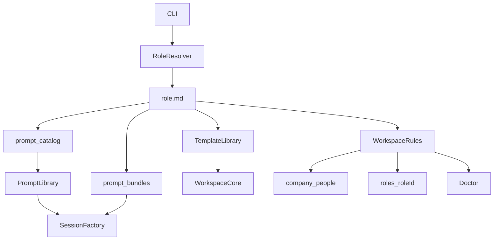

# Architecture Design

## Purpose

This project implements a local, file-first multi-role leadership agent. The workspace stays the system of record while the runtime remains a thin, deterministic orchestration layer around markdown files and a reusable agent session runtime.

## Core Idea

Separate the workspace into:

- shared root context in `company/` and `people/`
- role-local workspaces in `roles/<role-id>/`

Each role directory contains its own:

- `role.md` manifest
- `AGENTS.md` prompt index
- `agent/` operating system
- `prompts/` role-specific reusable instructions
- `templates/` markdown scaffold templates
- role-specific entity directories such as `deals/`, `tickets/`, or `campaigns/`

Shared prompts live at the workspace root in `prompts/`. Role-specific prompts live in `roles/<role-id>/prompts/`.

This keeps the shared organization context canonical while allowing each leadership role to define its own domain model and its own prompt overlays without changing the generic orchestration code.

## Design Principles

### 1. File-first system of record

Business state lives in markdown files and directories, not in a database. Shared truth and role-local truth are both inspectable, portable, and versionable.

### 2. File-defined role contracts

Roles are defined primarily by markdown and frontmatter:

- `role.md` defines the role contract
- shared prompts live under `prompts/`
- role-specific prompts live under `roles/<role-id>/prompts/`
- scaffold templates live under `roles/<role-id>/templates/`

This makes new roles mostly a file-creation exercise instead of a TypeScript refactor.

### 3. Deterministic orchestration stays in code

TypeScript still owns:

- CLI routing
- role resolution
- safe writes
- ID generation
- initialization checks
- validation
- transcript evidence placement
- tool wiring

Markdown defines structure and starter content. Code defines behavior that must stay predictable.

### 4. Shared core, role extension

The runtime should not know what a deal, ticket, or campaign is. It should know how to load a role manifest, render templates, scan entities, and run a session for the selected role.

## High-Level Flow



## Module Responsibilities

### `src/cli.ts`

Parses commands, resolves the workspace root, resolves or infers `--role`, and starts the right flow.

### `src/roles.ts`

Loads and validates `roles/<role-id>/role.md`, lists available roles, infers the current role from the working directory when possible, and resolves prompt IDs to either the shared prompt directory or the role-local prompt directory.

### `src/prompt-library.ts`

Loads the selected role's `AGENTS.md` and required prompts declared in `role.md`, then renders prompt bundles with lightweight placeholders such as `{{workspaceRoot}}`, `{{roleRoot}}`, `{{entityId}}`, and `{{transcriptPath}}`.

Important: prompt loading is intentionally a little more explicit than template loading because prompts come from two different scopes and must stay non-ambiguous.

- `prompt_catalog` in `role.md` maps a stable prompt ID to a `scope` (`shared` or `role`) and a file name.
- `required_prompts` defines the full set of prompt IDs the role is allowed to load and that doctor should validate.
- `prompt_bundles` defines which prompt IDs are concatenated into the system prompt for a given session kind such as `default`, `onboarding`, or `transcript-ingest`.
- `AGENTS.md` is the human-readable prompt index for the role and must link to every required prompt file, including shared prompts referenced via relative paths like `../../prompts/...`.

### `src/template-library.ts`

Loads markdown starter templates from disk and performs simple placeholder substitution. It intentionally avoids becoming a full templating engine.

### `src/workspace.ts`

Owns shared and role-local path resolution, scaffold creation, shared record creation, generic role-entity creation, entity scanning, transcript matching, and evidence placement.

### `src/session.ts`

Builds configured agent sessions for the selected role, chooses bundles, wires standard tools plus role-aware custom tools, and handles persisted sessions per role.

Session prompt assembly works like this:

1. Resolve the role and load its prompt catalog.
2. Load all prompt IDs listed in `required_prompts`.
3. Choose a bundle from `prompt_bundles` based on session kind and initialization state.
4. Render only that bundle into one concatenated prompt string.
5. Append that rendered bundle to the base system prompt for the agent runtime.

The runtime does not inject all prompts all the time. `required_prompts` is the validated prompt universe for the role. `prompt_bundles` is what actually gets injected for a given session.

### `src/agent-tools.ts`

Defines generic tools such as:

- `entity_lookup`
- `web_search`
- shared record creation tools
- role-derived entity creation tools from the manifest

### `src/ingest.ts`

Runs transcript ingest only for roles that declare a transcript-ingest capability in their manifest.

### `src/doctor.ts`

Validates the shared workspace plus the selected role contract, including prompt links, required files, duplicate IDs, and placeholder drift.

For prompts specifically, doctor verifies:

- every required prompt ID resolves through the role's `prompt_catalog`
- every required prompt file exists in the correct scope
- every bundle references known prompt IDs
- transcript-ingest prompt references stay inside the same prompt catalog
- `AGENTS.md` links match the resolved prompt file paths

## Workspace Contract

### Shared root

- `company/`
- `people/`
- `prompts/`
- `roles/`
- `templates/shared/`

### Per role

- `roles/<role-id>/role.md`
- `roles/<role-id>/AGENTS.md`
- `roles/<role-id>/agent/`
- `roles/<role-id>/prompts/` for role-only overlays
- `roles/<role-id>/templates/`
- role-specific entity directories from the manifest

## Prompt Contract

The prompt system uses four separate concepts on purpose:

### 1. `prompt_catalog`

This is the authoritative map from prompt ID to file location.

Each entry declares:

- the stable prompt ID used by code and bundles
- the `scope`: `shared` or `role`
- the backing file name inside that scope

Example:

```yaml
prompt_catalog:
  core-soul:
    scope: shared
    file: 00-soul.md
  sales-standard:
    scope: role
    file: 25-role-sales.md
```

Why this exists:

- avoids filename collisions between shared and role-local prompts
- lets bundles stay stable even if file names change later
- keeps scope explicit instead of inferring it from path conventions

### 2. `required_prompts`

This is the validated prompt universe for the role.

It means:

- these prompt IDs must exist
- these prompt files must be loadable
- these prompt files must be indexed in `AGENTS.md`

It does not mean every prompt is injected into every session.

### 3. `prompt_bundles`

This maps a session kind to the exact ordered list of prompt IDs that should be injected.

Example:

```yaml
prompt_bundles:
  default:
    - core-soul
    - file-rules
    - routing
    - sales-standard
    - agent-ops
```

This is how the runtime combines shared and role-specific instructions safely in one session without overlap-by-accident.

### 4. `AGENTS.md`

This is the human prompt index for the role.

It is not the source of truth for prompt resolution, but it must stay aligned with the manifest because it gives both humans and the runtime a readable map of the available prompt files.

For a role with shared and role-local prompts, `AGENTS.md` will usually link to both:

- shared prompts via `../../prompts/...`
- role prompts via `prompts/...`

## Why Prompt Loading Is More Explicit Than It Looks

The extra prompt-loading structure is deliberate, not accidental complexity.

The runtime needs to support all of the following at once:

- one shared prompt library reused by multiple roles
- role-local prompt overlays
- different prompt bundles for normal chat, onboarding, and transcript ingest
- deterministic validation with helpful doctor errors
- no accidental shadowing where two prompts with the same filename mean different things

Using prompt IDs plus explicit scope in `role.md` solves that cleanly while keeping the runtime generic.

## Why The Template Mechanism Is Generic

Templates are no longer hardcoded in TypeScript for each business object. Instead:

- role manifests declare which files each entity needs
- markdown templates provide starter content
- TypeScript computes dynamic values such as IDs, timestamps, ownership, and source references

That keeps the mechanism generic while keeping behavior deterministic.

## Extension Model

To add a new role:

1. Create `roles/<role-id>/role.md`
2. Add prompt catalog entries for shared and role-local prompts
3. Add `AGENTS.md`, role prompts, and templates
4. Define entity types, fields, and bundles in frontmatter
5. Optionally declare transcript ingest if that role needs it

No orchestration changes should be required for a standard role.
