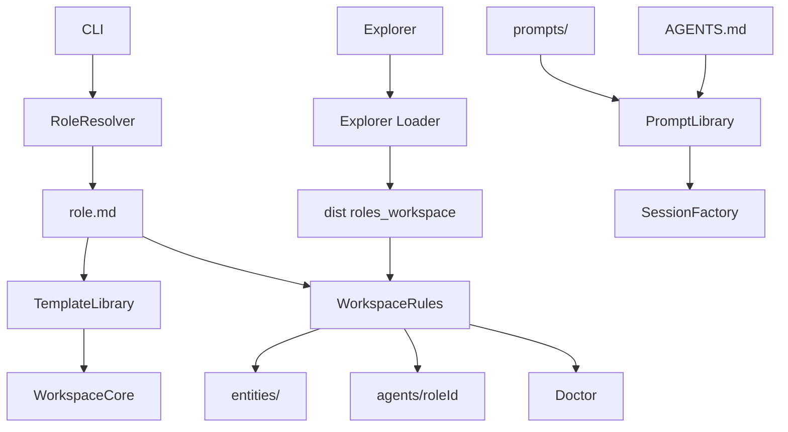

# Architecture Design

## Purpose

Hermit implements a local, file-first runtime for autonomous applications. In the current workspace, that runtime is applied to a multi-role leadership agent system. The workspace stays the system of record while the runtime remains a thin, deterministic orchestration layer around markdown files and a reusable agent session runtime.

## Core Idea

Separate the workspace into:

- entity instance data in `entities/`
- entity type definitions, templates, and renderers in `entity-defs/`
- agent-local workspaces in `agents/<role-id>/`

The `entities/` directory contains entity data only:

- `entities/company/` and `entities/people/` for shared context
- entity data directories such as `entities/deals/`, `entities/tickets/`, etc.

The `entity-defs/` directory contains entity type definitions:

- scaffold templates organized by type (e.g., `entity-defs/deal/`, `entity-defs/product/`)
- custom explorer renderers under `entity-defs/renderers/`
- shared skills live under `skills/`

Each agent directory contains its own:

- `role.md` manifest
- `AGENTS.md` prompt index
- `agent/` operating system
- `prompts/` role-specific reusable instructions
- `skills/` role-specific pi skills

Shared prompts live at the workspace root in `prompts/`. Role-specific prompts live in `agents/<role-id>/prompts/`.

This keeps the shared organization context canonical while allowing each leadership role to define its own domain model and its own prompt overlays without changing the generic orchestration code.

## Design Principles

### 1. File-first system of record

Business state lives in markdown files and directories, not in a database. Shared truth and entity data are both inspectable, portable, and versionable.

### 2. File-defined role contracts

Roles are defined primarily by markdown and frontmatter:

- `role.md` defines the role contract
- shared prompts live under `prompts/`
- shared skills live under `skills/`
- role-specific prompts live under `agents/<role-id>/prompts/`
- role-specific skills live under `agents/<role-id>/skills/`
- scaffold templates live under `entity-defs/`

This makes new roles mostly a file-creation exercise instead of a TypeScript refactor.

### 3. Deterministic orchestration stays in code

TypeScript still owns:

- CLI routing
- role resolution
- safe writes
- ID generation
- initialization checks
- validation
- transcript evidence placement
- tool wiring
- local telemetry capture and report generation

Markdown defines structure and starter content. Code defines behavior that must stay predictable.

### 4. Shared core, role extension

The runtime should not know what a deal, ticket, or campaign is. It should know how to load a role manifest, render templates, scan entities, and run a session for the selected role.

### 5. Read-only explorer on top of the same workspace

The local explorer is a separate Astro app under `explorer/`, but it is intentionally not a second source of truth and not a second domain model. It is a read-only browser for the same file-first workspace.

The explorer should:

- read the shared root context from `entities/company/` and `entities/people/`
- read role manifests and scanned entities from the same root TypeScript runtime used by the CLI
- render markdown files directly instead of copying data into a database or API layer
- stay thin enough that adding a new role or entity type is still primarily a manifest-and-files exercise

## High-Level Flow



## Module Responsibilities

### `src/cli.ts`

Parses commands, resolves the workspace root, resolves or infers `--role`, and starts the right flow. The published CLI name is `hermit`.

Normal `chat` and `ask` sessions take the role and the user prompt. The user points the agent at the right deal, product, or person inside the conversation, and the agent resolves that target from the workspace files or `entity_lookup` when needed. `heartbeat` runs a single unattended upkeep turn for a selected role, intended for cron-style GTD maintenance. `ingest transcript` accepts `--entity` because evidence placement benefits from an explicit deterministic target.

### `src/roles.ts`

Loads and validates `agents/<role-id>/role.md`, lists available roles, and infers the current role from the working directory when possible.

### `src/prompt-library.ts`

Auto-discovers all shared prompts from `prompts/`, loads the role's `AGENTS.md`, and renders them into a single system prompt with lightweight placeholders such as `{{workspaceRoot}}`, `{{roleRoot}}`, `{{entityId}}`, and `{{transcriptPath}}`.

Those entity placeholders are optional context, not a requirement for normal chat. Most interactive sessions start unanchored, with `entityId` and `entityPath` left as `not-selected` until the agent resolves the target from the request and the files.

The system prompt is always: all shared prompts (sorted by filename) + role `AGENTS.md`. Role-specific on-demand prompts are read by the agent during the session when the task requires them. For transcript ingest sessions, additional role prompts listed in `transcript_ingest.system_prompts` are appended to the system prompt.

### `src/template-library.ts`

Loads markdown starter templates from disk and performs simple placeholder substitution. It intentionally avoids becoming a full templating engine.

### `src/workspace.ts`

Owns shared and entity path resolution, scaffold creation, shared record creation, generic role-entity creation, entity scanning, transcript matching, and evidence placement.

### `explorer/`

A local Astro SSR app that provides a read-only browser for the workspace.

It is intentionally thin:

- routes live under `explorer/src/pages/`
- shared markdown parsing helpers live under `explorer/src/lib/entity-content.ts`
- root workspace and role loading adapters live under `explorer/src/lib/workspace.ts`

Instead of duplicating business logic, the explorer dynamically imports the built root modules from `dist/roles.js` and `dist/workspace.js`, then reuses:

- role listing
- role manifest loading
- generic entity scanning
- entity lookup by type

This means the CLI and explorer read the same role and entity model, while the explorer stays read-only.

Current route model:

- `/` shows the explorer home page with links to shared and agent areas
- `/company` renders the shared company markdown files from `entities/company/`
- `/people` lists shared people records from `entities/people/`
- `/people/:personId` renders a person's markdown files such as `record.md` and `development-plan.md`
- `/agents/:roleId` shows an agent overview
- `/agents/:roleId/agent` renders `agent/record.md` and `agent/inbox.md` for that agent
- `/agents/:roleId/:entityType` renders a generic list view for that entity type using role manifest field metadata
- `/agents/:roleId/:entityType/:entityId` renders the entity detail view from the markdown files declared in the role manifest

The explorer has no write path. Any canonical update still happens through normal file edits or the CLI runtime.

### `src/session.ts`

Builds configured agent sessions for the selected role, chooses the base prompt set for startup, wires standard tools plus role-aware custom tools, and handles persisted sessions per role.

Session prompt assembly works like this:

1. Resolve the role and load its manifest.
2. Auto-discover and load all shared prompts from `prompts/`.
3. Load the role's `AGENTS.md`.
4. If the session specifies additional role prompts (e.g., transcript ingest system prompts), load those too.
5. Render all loaded prompts into one concatenated system prompt string using the current prompt context.
6. Append that rendered prompt string to the base system prompt for the agent runtime.

In addition to prompts, the session enables pi skill discovery from:

- shared workspace `skills/`
- role-local `agents/<role-id>/skills/`

Those skills stay on-demand. They are not concatenated into the Hermit prompt stack; pi advertises them to the model so the model can read the relevant `SKILL.md` only when the task matches.

For normal `chat` and `ask`, prompt context usually includes the workspace and role but not a preselected entity. The startup prompt explicitly tells the agent to resolve the relevant deal, product, or person during the session before going deep, then read additional role prompt files on demand when they are relevant. Transcript ingest is the main path that still commonly starts with an explicit entity target.

Heartbeat runs use the same role system prompt stack but send a deterministic one-shot upkeep prompt focused on small GTD-style backlog advancement. Their persisted transcripts live in a separate role-local history directory so unattended background sessions do not mix with interactive chat history.

### `src/agent-tools.ts`

Defines generic tools such as:

- `entity_lookup`
- `web_search`
- shared record creation tools
- role-derived entity creation tools from the manifest

### `src/ingest.ts`

Runs transcript ingest only for roles that declare a transcript-ingest capability in their manifest.

### `src/telemetry.ts`

Owns local-first runtime telemetry capture and aggregation.

It records append-only structured events for session starts and ends, turn starts and ends, first-token latency, tool execution, assistant errors, retries, and compaction. It also generates rollup reports for recent windows such as `24h` or `7d`.

Raw telemetry stays local under `.hermit/telemetry/events/`. Aggregated reports are written under `.hermit/telemetry/reports/`. Report aggregation only includes completed sessions so in-flight activity does not skew counts and rates.

### `src/doctor.ts`

Validates the shared workspace plus the selected role contract, including prompt links, required files, duplicate IDs, and placeholder drift.

For prompts specifically, doctor verifies:

- shared prompts directory exists
- `AGENTS.md` exists and linked files resolve
- transcript ingest prompt files exist when configured

## Workspace Contract

### Shared root

- `entities/`
- `entities/company/`
- `entities/people/`
- `entity-defs/`
- `skills/`
- `prompts/`
- `agents/`
- `explorer/`

### Per agent

- `agents/<role-id>/role.md`
- `agents/<role-id>/AGENTS.md`
- `agents/<role-id>/agent/`
- `agents/<role-id>/prompts/` for role-only overlays
- `agents/<role-id>/skills/` for role-only pi skills

## Prompt Contract

The prompt system uses two layers:

### 1. Shared prompts (`prompts/`)

All `.md` files in the root `prompts/` directory are auto-discovered, sorted by filename, and included in every session's system prompt. These define the agent's core identity, file-first behavior, routing guidance, agent operating system, and maintenance rules.

Shared prompts are self-gating: each file declares when it applies (e.g., onboarding, self-improvement), so including all of them does not cause unwanted behavior in sessions where they are not relevant.

### 2. Role `AGENTS.md`

This is both the role-level system prompt and the on-demand prompt index. It is appended to the system prompt after shared prompts.

`AGENTS.md` should contain:

- the role's operating standard (leadership lens, core standard, operating expectations)
- startup context (which files to read first at session start)
- entity context (which entities in `entities/` this role manages)
- an on-demand prompt index linking to role prompt files in `prompts/`

On-demand role prompts live in `agents/<role-id>/prompts/` and are read by the agent during the session when the task requires them. The runtime does not inject them automatically.

For transcript ingest sessions, `transcript_ingest.system_prompts` in `role.md` lists additional role prompt files to append to the system prompt alongside the shared prompts and `AGENTS.md`.

## Self-Improvement Loop

Hermit's self-improvement model is workspace-wide rather than prompt-only.

Improvement work should usually follow this path:

1. Observe a reusable gap from explicit user feedback, repeated manual fixes, `doctor` findings, failing tests, or telemetry patterns.
2. Choose the smallest correct change surface:
   - `prompts/` or role prompts for reusable operating guidance
   - `src/` for deterministic runtime behavior
   - `entity-defs/` for scaffold and canonical file defaults
   - `entity-defs/renderers/` plus role manifests for explorer rendering
   - docs and tests for explicit contract hardening
3. Make the smallest cohesive change that fixes the root cause.
4. Validate the change with the nearest checks available, such as tests, `doctor`, renderer loading, or telemetry review.

This loop is intentionally local, explicit, and reviewable. Telemetry and validation inform changes, but Hermit does not silently auto-apply repo mutations from runtime observations alone.

## Why The Template Mechanism Is Generic

Templates are defined generically rather than hardcoded in TypeScript for each business object. Instead:

- role manifests declare which files each entity needs
- markdown templates in `entity-defs/` provide starter content
- TypeScript computes dynamic values such as IDs, timestamps, ownership, and source references

That keeps the mechanism generic while keeping behavior deterministic.

## Extension Model

To add a new role:

1. Create `agents/<role-id>/role.md` with entity types and fields
2. Create `AGENTS.md` with the role operating standard, startup context, and on-demand prompt index
3. Add role-specific prompts under `agents/<role-id>/prompts/`
4. Add entity templates under `entity-defs/`
5. Optionally declare transcript ingest if that role needs it

No orchestration changes should be required for a standard role.

## Explorer Design Notes

The explorer deliberately sits one level above the canonical files rather than in front of a custom API.

Why:

- the workspace is already the system of record
- the root runtime already knows how to load roles and scan entities generically
- markdown files are the display payload, so adding a persistence or serialization layer would add complexity without changing the source of truth

In practice, this means:

- shared pages such as `company` and `people` read markdown from `entities/` directly
- role pages reuse the root `dist/` modules for manifest-aware scanning
- role entity lists are driven by manifest metadata, not hardcoded per entity type
- role detail pages render the markdown files declared by each entity definition
- role manifests may optionally declare explorer renderers for entity detail pages or specific entity files, with fallback to the default markdown renderer

Optional explorer renderers live under `entity-defs/renderers/` and are referenced from `role.md`, for example:

```yaml
explorer:
  renderers:
    detail:
      deal: renderers/deal-detail.mjs
    files:
      deal:
        meddicc.md: renderers/deal-meddicc.mjs
```

Each renderer module is loaded dynamically by the explorer at runtime. Detail renderers can replace the full entity detail body for a given entity type. File renderers can replace the default rendering for a specific file like `meddicc.md`. If no matching renderer is declared, the explorer uses the built-in generic markdown view.
