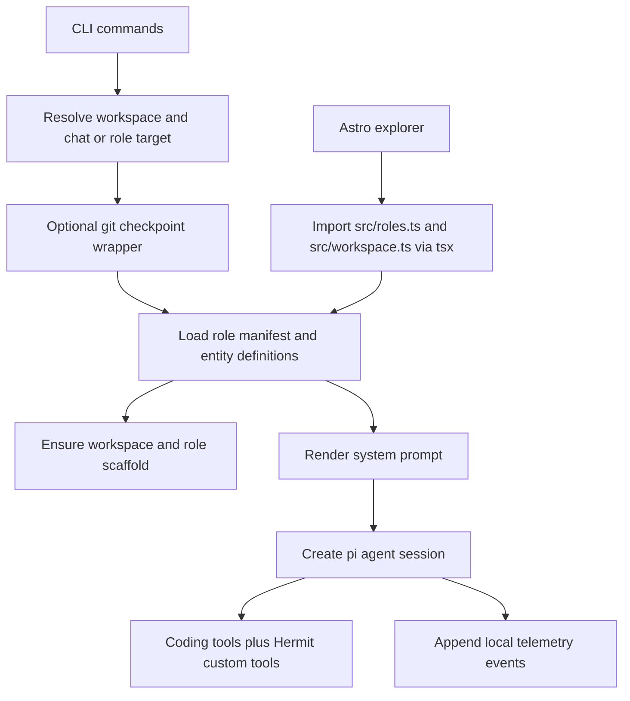

# Architecture

## Purpose

Hermit is a local, file-first runtime where agents are the application. Agents own domain state, make decisions, and evolve the workspace and code. The workspace on disk is canonical — there is no separate database or service layer.

Code handles the deterministic infrastructure that should not depend on model improvisation: command routing, role resolution, session construction, entity scaffolding, validation, git checkpointing, and local telemetry. Everything else — strategy, judgment, record-keeping, entity updates — is agent work driven by prompts and skills.

## Invariants

- Canonical state lives in files. Agents are the writers; code provides structure and plumbing.
- Roles, entity definitions, and durable state are loaded from the workspace at runtime; built-in prompts, templates, and built-in skills are loaded from the framework repo.
- Domain structure stays in markdown and frontmatter; deterministic mechanics stay in code.
- The explorer is intentionally read-only. Agents manage application state; the explorer renders it.
- Telemetry is local and append-only.

## Workspace Model

Hermit uses a split layout by default:

- the framework repo holds Hermit's runtime code, built-in prompts, built-in templates, explorer code, docs, and built-in skills
- the workspace repo lives at `./workspace` under the framework checkout unless `HERMIT_WORKSPACE_ROOT` overrides it

On first run from the framework checkout, Hermit creates `./workspace`, initializes it as a git repo, and scaffolds the required workspace directories there.
The framework repo ignores `./workspace/`, so app-state changes stay out of framework pull requests by default.

### Workspace root

- `workspace/entities/` holds canonical entity records, including role-managed entities.
- `workspace/entity-defs/entities.md` defines entity types and optional explorer renderer config.
- `workspace/entity-defs/` also holds entity templates and optional renderer modules.
- `workspace/skills/` holds workspace-local shared pi skills.
- `workspace/inbox/` holds uncategorized incoming user files until an agent routes them to the right durable location or removes them as temporary drops.
- `workspace/prompts/` holds workspace prompt overrides and shared template overrides.
- `workspace/agents/` holds one directory per role.
- `workspace/.hermit/` holds Hermit's own runtime state, including chat and heartbeat session history, telemetry, last-role state, and Hermit's shared `agent/record.md` and `agent/inbox.md` for framework stewardship.

### Framework root

- `src/`, `explorer/`, `docs/`, tests, scripts, and package metadata define the Hermit runtime itself.
- `prompts/` holds built-in shared prompts plus built-in agent templates.
- `skills/` holds built-in framework skills.
- Framework PR and update workflows use normal `git` and `gh` commands, typically guided by the built-in framework-maintenance skill.

### Per role

Each `agents/<role-id>/` directory contains:

- `role.md` for the role manifest
- `AGENTS.md` for the role-level prompt and prompt index
- `agent/record.md` and `agent/inbox.md`
- `prompts/` for role-local prompt files
- `skills/` for role-local skills
- `.role-agent/sessions/` for persisted interactive sessions
- `.role-agent/heartbeat-sessions/` for persisted heartbeat sessions

Role-owned entities live under `workspace/entities/`, not under `workspace/agents/<role-id>/`. The runtime distinguishes shared versus role-managed entities by the directory roots declared in `workspace/entity-defs/entities.md`.

Runtime scaffolding and `doctor` hard-require `workspace/entities/`, `workspace/agents/`, `workspace/entity-defs/`, `workspace/skills/`, and `workspace/inbox/`. Role sessions also require `workspace/prompts/`, `AGENTS.md`, shared agent templates, and any prompt or renderer files referenced by the role.

## Runtime Flow

## Source Module Map

`src/` stays intentionally flat, but the files are grouped by responsibility:

- **Shared primitives**: `constants.ts`, `types.ts`, `abort.ts`, `duration.ts`, `fs-utils.ts`, `runtime-paths.ts`, `type-guards.ts`
- **Workspace and role loading**: `roles.ts`, `workspace.ts`, `entity-graph.ts`
- **Prompt and template assembly**: `prompt-library.ts`, `template-library.ts`, `session-prompts.ts`
- **Session construction and tools**: `session-runtime.ts`, `agent-tools.ts`, `image-attachments.ts`
- **Session presentation and terminal plumbing**: `session-formatting.ts`, `session-terminal.ts`, `session-loop.ts`, `interactive-session-controller.ts`, `tui-components.ts`, `workspace-start-display.ts`, `workspace-start.ts`
- **Command orchestration**: `cli.ts`, `cli-session.ts`, `cli-heartbeat.ts`, `heartbeat-daemon.ts`, `start-launcher.ts`
- **Safety, diagnostics, and support**: `turn-control.ts`, `git.ts`, `doctor.ts`, `model-auth.ts`, `tailscale.ts`, `telemetry-events.ts`, `telemetry-recorder.ts`, `telemetry-report.ts`

The intended dependency direction is:

- low-level helpers should stay reusable and avoid depending on session creation or CLI orchestration
- session construction should not depend on TUI code
- formatting/rendering helpers should stay separate from streaming and terminal lifecycle code
- CLI entrypoints should compose the lower layers rather than implement them inline

## Command Surface

- `start` is the primary runtime entrypoint. It opens the combined workspace screen with explorer, background heartbeats, and interactive chat. Chat target resolution order: `--role`, inferred role from the current directory under `workspace/agents/`, last used chat role from `.hermit/state/last-role.txt`, then `Hermit`. The Hermit fallback applies even when roles exist. Bootstrap mode is enabled only when the resolved target is `Hermit` and no roles are configured. Interactive chat supports runtime role switching through the `switch_role` tool. When `HERMIT_TELEGRAM_BOT_TOKEN` (or `TELEGRAM_BOT_TOKEN`) plus `HERMIT_TELEGRAM_CHAT_ID` are configured, `start` also long-polls Telegram, converts inbound messages from that one chat into queued prompts in the main chat thread, and persists the next Telegram update offset under `.hermit/state/telegram.json`.
- `ask` runs a one-shot prompt in a role-backed session. Resolution: `--role`, inferred role from cwd, then single-role auto-selection. No last-role fallback, no Hermit fallback. Errors when no role can be resolved.
- Background heartbeats are launched only from `start`. The loop runs normal role heartbeats on a fixed interval. When any strategic review is due, it runs one combined strategic-review sweep for `Hermit` plus all configured roles, with one separate session per target.
- `telemetry report` aggregates local telemetry into Markdown and JSON reports, including session outcome counts.
- `doctor` validates shared workspace structure plus the selected role contract. `doctor --context` also prints the rendered system-prompt file breakdown and char counts for the selected role.

## Prompt Assembly

System prompt construction:

1. Load `prompts/*.md`, sorted by filename. Subdirectories are not loaded recursively.
2. For role-backed sessions, append `agents/<role-id>/AGENTS.md`.
3. For Hermit bootstrap chat only, append all `.md` files under `prompts/bootstrap/`.

Role-local prompts are on-demand; they are loaded only when a session explicitly requests them.

`PromptLibrary` can report the active prompt-part breakdown as source paths plus rendered char counts.

### Template placeholders

| Placeholder | Fallback |
|---|---|
| `{{workspaceRoot}}` | — |
| `{{roleId}}` | `Hermit` |
| `{{roleRoot}}` | `.` |
| `{{entityId}}` | `not-selected` |
| `{{entityPath}}` | `not-selected` |
| `{{currentDateTimeIso}}` | `unknown` |
| `{{currentLocalDateTime}}` | `unknown` |
| `{{currentTimeZone}}` | `unknown` |
| `{{gitBranch}}` | `unknown` |
| `{{gitHeadSha}}` | `unknown` |
| `{{gitHeadShortSha}}` | `unknown` |
| `{{gitHeadSubject}}` | `unknown` |
| `{{gitDirty}}` | `unknown` |
| `{{gitCheckpointBeforeSha}}` | `not-created` |
| `{{gitCheckpointAfterSha}}` | `not-created` |

## Sessions, Skills, and Tools

Session creation lives in `src/session-runtime.ts` and uses `@mariozechner/pi-coding-agent`.

Skills:

- Hermit sessions load from `skills/`.
- Role sessions load from `skills/` and `agents/<role-id>/skills/`.
- Skills stay on-demand through pi skill discovery; they are not concatenated into the system prompt.

Session history:

- Hermit interactive: `.hermit/sessions/hermit`
- Hermit heartbeat: `.hermit/sessions/hermit-heartbeat`
- Hermit review state: `.hermit/agent/record.md` and `.hermit/agent/inbox.md`
- Role interactive: `agents/<role-id>/.role-agent/sessions`
- Role heartbeat: `agents/<role-id>/.role-agent/heartbeat-sessions`

Every session gets standard coding tools. Custom tools by session type:

- **Role sessions**: `entity_lookup`, `web_search`, one `create_<entity>_record` per entity definition
- **Role interactive** (with role switching enabled): adds `switch_role`
- **Telegram-enabled sessions**: add `send_telegram_message` for short text replies and `send_telegram_voice_note` for generated spoken replies to the configured Telegram chat
- **Hermit sessions**: `web_search`, plus `switch_role` when role switching is enabled

Model selection is provider-aware:

- If `ROLE_AGENT_MODEL` is unset, Hermit auto-selects the best available configured model.
- Preferred model comes from `ROLE_AGENT_MODEL` when explicitly set.
- Optional fallback models come from `ROLE_AGENT_FALLBACK_MODELS`.
- If explicit preferences do not resolve, Hermit falls back to the best available configured model it can use.
- `web_search` currently supports OpenAI and Anthropic credentials. If both are configured, Hermit prefers the provider pinned by `ROLE_AGENT_MODEL` when that provider is OpenAI or Anthropic.

Thinking level: `ROLE_AGENT_THINKING_LEVEL` env var, default `medium`.

## Entity and Workspace Mechanics

`entity-defs/entities.md` is the runtime contract for entity structure. Each definition specifies:

- `key`, `label`, `type`
- `create_directory`, optional `scan_directories`, optional `exclude_directory_names`
- `id_strategy`: `prefixed-slug`, `year-sequence-slug`, or `singleton`
- `id_source_fields`, optional `id_prefix`, `name_template`
- `fields` with per-field `key`, `label`, `type` (`string`, `number`, `boolean`, or `string-array`), `description`, optional `required` and `defaultValue`
- Optional `relationships` with per-relationship `source_field`, `target_type`, `edge_type`, and optional `reverse_edge_type`
- `files` with per-file `path` and `template`
- Optional `status_field`, `owner_field`, `include_in_initialization`, `extra_directories`
- Optional `explorer.renderers` for home-page, custom-page, entity-list, detail-level, and file-level custom rendering

`ensureWorkspaceScaffold()` creates shared root directories and role-local directories. For existing roles, it backfills `agent/record.md` and `agent/inbox.md` from `prompts/templates/agent/*.md` when missing.

The shared `workspace/inbox/` directory is a transient intake area, not a canonical store. Agents are expected to triage new files dropped there into the correct entity or role directories, preserve source references when those files change canonical understanding, and remove one-off temporary files once their contents are safely captured elsewhere.

`createRoleEntityRecord()` renders declared entity files, computes a deterministic ID, and writes without overwriting unless forced.

Entity scanning is filesystem-based. A directory containing `record.md` is an entity leaf. Shared entity scanning excludes directory roots claimed by role entity definitions. Role entity scanning uses each definition's `scan_directories` or `create_directory`.

Graph-style queries are a derived read model, not a second source of truth. The runtime can build an in-memory entity graph on demand by scanning the current markdown entities, loading relationship declarations from `entity-defs/entities.md`, and projecting typed edges from frontmatter references. Broken or mistyped references remain visible as diagnostics instead of silently rewriting the markdown store.

## Git Checkpoints

Interactive chat turns inside `start` and `ask` run inside `withGitCheckpoint()`. The background heartbeat loop launched by `start` does not checkpoint as one process; each delegated heartbeat has its own checkpoint wrapper.

- Before the command: checkpoint each distinct git repo involved in the turn if that repo is dirty.
- After the command: checkpoint each distinct git repo involved in the turn if that repo is dirty and the command outcome policy allows it.
- Command outcomes are tracked as `success`, `aborted`, or `failed` and recorded in checkpoint metadata and telemetry.
- Dirty detection: `git status --porcelain=v1 --untracked-files=all`.
- Checkpoints stage and commit the full changed file set, including untracked files.
- No path allowlist inside a single repo. The framework/workspace split is the structural safety boundary.
- No automatic rollback.

## Validation

`doctor` is a structural validator. Checks:

- Required workspace-root directories (`workspace/entities`, `workspace/agents`, `workspace/entity-defs`, `workspace/skills`, `workspace/inbox`)
- Hermit shared state under `workspace/.hermit/agent/` when `--role Hermit` is selected
- Role manifest loading and directory identity for normal roles
- `AGENTS.md` presence and linked markdown files for normal roles
- Required shared agent templates and transcript ingest prompts
- Explorer renderer modules
- Presence and frontmatter shape of `workspace/entity-defs/entities.md` (warning if missing, error if malformed)
- Duplicate entity IDs
- Missing frontmatter fields in entity records
- Unresolved template placeholders and generic placeholder lines
- Missing entity files declared by entity definitions
- Presence of at least one supported provider credential (warning, not error)

Exits non-zero only when at least one `error`-level finding exists.

## Explorer

Astro SSR app under `explorer/`. Read-only by design — agents own and mutate workspace state through sessions; the explorer is a viewer, not an editor. It imports `src/roles.ts` and `src/workspace.ts` from the repo root through `tsx`, so it uses the same entity definitions and scanning logic as the CLI without a separate build step.

| Route | Content |
|---|---|
| `/` | Home |
| `/architecture` | Architecture |
| `/license` | License |
| `/entities` | Entity type list |
| `/entities/:entityType` | Entity list |
| `/entities/:entityType/:entityId` | Entity detail |
| `/agents` | Agent list |
| `/agents/:roleId` | Agent detail |
| `/<custom-page>` | Optional workspace-defined explorer page when declared in `explorer.renderers.pages` |

No per-role entity routes.

### Renderers

`workspace/entity-defs/entities.md` may declare explorer renderers under `explorer.renderers`. Modules are loaded dynamically from `workspace/entity-defs/` and can replace the home page, custom top-level pages, entity-type list pages, the full entity detail body, or specific file sections. Without a declared renderer, the explorer falls back to its built-in generic pages and markdown rendering.

## Extension Surface

Extensions are file-driven:

- Add a role: create `workspace/agents/<role-id>/role.md`, `AGENTS.md`, role prompts, and role skills.
- Add an entity type: update `workspace/entity-defs/entities.md` and add templates.
- Add explorer customization: place renderer modules under `workspace/entity-defs/` and reference them.

No code changes required for standard role and entity additions.
